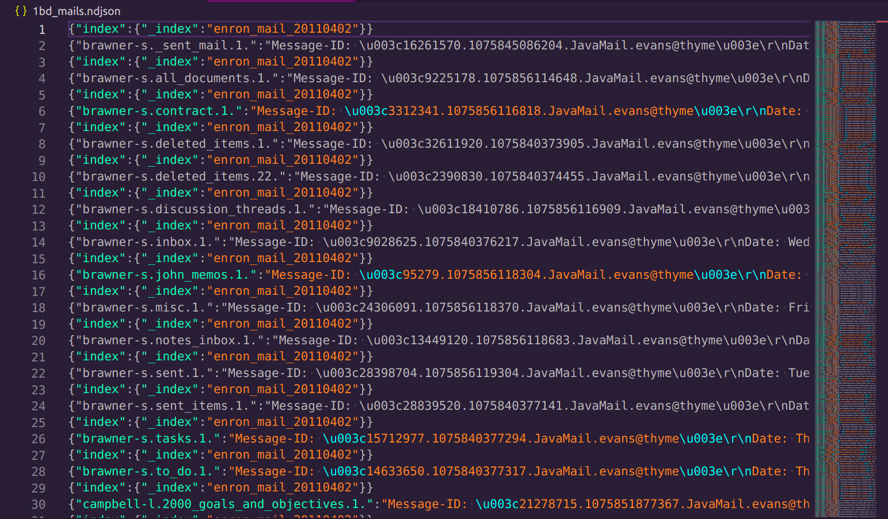

# ...[Email search engine]...

Este es el back-end del sistema de **Indexación de contenidos en la herramienta [ZincSearch](https://zincsearch.com/)**.

## Archivos relacionados:

- 📁 **ejemplo_bds ->** contiene un ejemplo de base de datos para poder indexar.
- 📁 **functions ->** contiene las funciones utilizadas por main.go.
- 📁 **test ->** carpeta de test
- 📄 **indexer ->** ejecutable
- 📄📄📄 **main.go - go.sum - go.mod**

## Contenido
El proyecto esta realizado en:

- [Go](https://go.dev/)

## Programas necesarios

Para poder utilizar el proyecto en localhost en necesario clonarlo y tener algunos programas necesarios:

- [GO in Ubuntu ](https://www.digitalocean.com/community/tutorials/how-to-install-go-on-ubuntu-20-04) v1.13 o Superior.
- IDE de desarrollo de tu comodidad Ej. [VS Code](https://code.visualstudio.com/download)
- [PostMan](https://www.postman.com/downloads/) para puebas de APIS. (Opcional)

- [ZincSearch](https://zincsearch.com/)

## Como Clonar

Comando para clonar:

```bash
cd existing_folder
git clone git@github.com:jhojanperlaza/email_search_engine.git

```

## Run en LocalHost:
 
**1**.Dirigirse a la carpeta donde tengas instalado ZincSearch y ejecutar:
```bash
ZINC_FIRST_ADMIN_USER=admin ZINC_FIRST_ADMIN_PASSWORD=Complexpass#123 ./zinc
```
**2**. Ahora en la carpeta donde se clono el proyecto ejecutar:
```bash
./indexer ejemplo_bds

{"message": "bulk data inserted", "record_count":n}
Database indexing successful!!
```
### Test
```bash
cd /test
```
```bash
go test -cpuprofile=cpu.out
```
```bash
go tool pprof cpu.out
```

### Autor

Desarrollo realizado por [Jhojan David Perlaza](https://github.com/jhojanperlaza)
