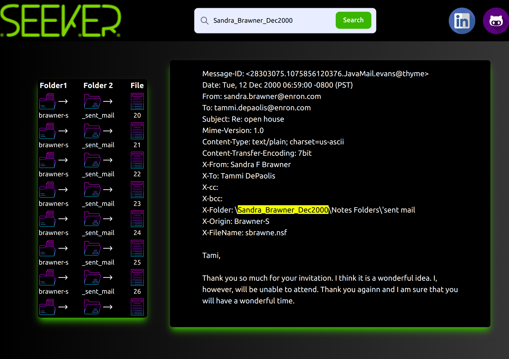

# ...[Email search engine]...

Esta en la interfaz de contenido despues de ser indexada

## Contenido
El proyecto esta realizado en:

- [Go](https://go.dev/)
- [Vue 3 ](https://vuejs.org/)

## Programas necesarios

Para poder utilizar el proyecto en localhost en necesario clonarlo y tener algunos programas necesarios:

- [GO in Ubuntu ](https://www.digitalocean.com/community/tutorials/how-to-install-go-on-ubuntu-20-04) v1.13 o Superior.
- IDE de desarrollo de tu comodidad Ej. [VS Code](https://code.visualstudio.com/download)
- [PostMan](https://www.postman.com/downloads/) para puebas de APIS. (Opcional)

- [ZincSearch](https://zincsearch.com/)

-[Vue 3](https://vuejs.org/guide/quick-start.html)


## Run en LocalHost:
 
**1**.Dirigirse a la carpeta donde tengas instalado ZincSearch y ejecutar:
```bash
ZINC_FIRST_ADMIN_USER=admin ZINC_FIRST_ADMIN_PASSWORD=Complexpass#123 ./zinc
```
**2**. Ejecutar en la terminal:
```bash
cd interfaz_seeker
```
```bash
npm install
```
```bash
npm run build
```
```bash
cd ..
```
```bash
go run server.go
```


### Autor

Desarrollo realizado por [Jhojan David Perlaza](https://github.com/jhojanperlaza)